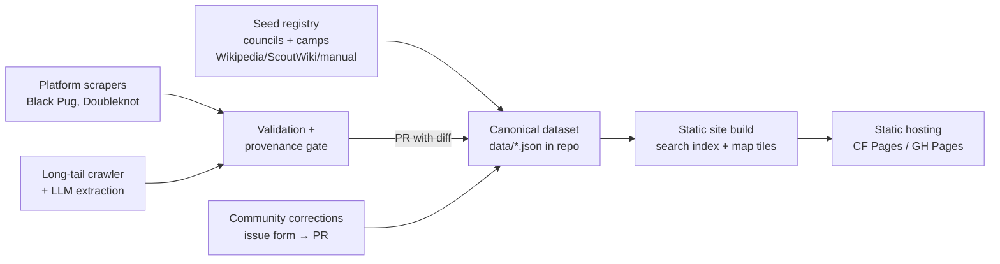

# Camp Finder — Feasibility & Implementation Plan

A national discovery tool for Scouting America council summer camps. Troops search by
location, dates, cost, and program features; every listing links to the council's
authoritative page. We aggregate and point — we are never the source of truth.

> **Companion documents:**
> - [`IMPLEMENTATION.md`](./IMPLEMENTATION.md) — self-contained build spec (stack, repo
>   layout, typed schema, scrapers, pipeline, frontend, task-by-task acceptance gates).
>   Hand this to the implementing engineer/agent.
> - [`DESIGN_BRIEF.md`](./DESIGN_BRIEF.md) — input for the Claude designer; specifies the
>   design handoff package the implementer will build against.

## 1. Problem

- ~242 local councils each independently operate summer camps (roughly 400–600 active
  camp properties nationally, a few thousand sessions per summer).
- No national directory exists with operational data. Scouting America provides a
  council locator only. Wikipedia / ScoutWiki lists are stale name+location inventories
  with no dates, costs, or programs.
- Discovery today requires already knowing a camp exists. Out-of-council attendance is
  common (and revenue councils actively want), so both sides benefit from discovery.

## 2. Feasibility Verdict

**Feasible, with the right shape.** Three findings make this tractable:

1. **Registration platform consolidation.** Most councils run registration through a
   small number of platforms:
   - **Black Pug / 247scouting.com** — dominant and growing; structured event pages
     with sessions, dates, and fees.
   - **Doubleknot** — significant legacy share.
   - **Tentaroo** — shutting down Oct 2026; its councils are migrating to Black Pug.
   One scraper per platform covers dozens of councils. Only the long tail of bespoke
   council sites needs page-level extraction.
2. **Tiny data scale.** The entire national dataset is a few hundred KB. No backend,
   no database server, no search infrastructure required — client-side search over a
   static dataset is sufficient and free to host.
3. **Annual cadence.** Camp data changes on a seasonal cycle (councils publish
   next-summer info roughly Sept–Jan). A yearly refresh with spot fixes is enough;
   this is not a real-time system.

### Risks (and mitigations)

| Risk | Mitigation |
|---|---|
| Scraper brittleness across hundreds of sites | Platform-level scrapers for the big two; LLM structured extraction (layout-tolerant) for the long tail; validation gates before data merges |
| Stale/wrong data misleading troops | Provenance on every field (`source_url`, `verified_at`); visible "last verified" badges; link-out-first UX — we advertise the authoritative source, never replace it |
| Councils merging / camps changing hands | Stable camp IDs independent of council; council is an attribute, not the key |
| Scraping etiquette / ToS | Public marketing data; respect robots.txt; rate-limit; identify the bot; honor takedown requests; councils benefit from the traffic — later, offer "claim your listing" |
| Volunteer maintenance burden | Data-as-code in the repo (reviewable via PRs), CI-automated refresh, zero-ops static hosting, community corrections |

## 3. Scope

**v1 in scope:** Scouts BSA resident summer camps (the "troop summer camp" use case).
**v1 out of scope (deliberate):** Cub day/resident camps, high-adventure bases
(Philmont etc. are already well known), GSUSA, non-US. The schema should not preclude
adding these later (`program_type` field from day one).

## 4. Data Model (canonical schema)

```
Council      { id, name, number, hq_city, state, website, platform }   # platform: blackpug | doubleknot | other
Camp         { id, name, council_id, lat, lon, address, state,
               website_url,            # authoritative link — the product's #1 payload
               program_types[],        # scouts_bsa_resident (v1), cub_day, ...
               features[],             # dining_hall, waterfront, atv, older_scout_program, ...
               status,                 # active | not_operating | closed
               provenance { source_url, method, verified_at } }
Session      { id, camp_id, year, start_date, end_date,
               fee_youth, fee_adult, fee_notes,
               registration_url,
               provenance { ... } }
```

Storage: newline-stable JSON (one file per council under `data/`) compiled to a single
`camps.json` + SQLite artifact at build time. Human-reviewable diffs are the point.

## 5. Architecture



- **Pipeline (Python):** scrapers emit candidate records; a validation gate checks
  schema, geocodes, flags anomalies (fee = $0, dates outside May–Aug, dead links);
  output lands as a PR diff against `data/` so a human approves every change.
- **Long-tail extraction:** fetch council camping pages → LLM extracts into the schema
  with confidence scores + source quotes; low-confidence fields go to a review queue,
  never straight to the dataset.
- **Frontend:** static site (Astro or Next SSG), client-side filtering over
  `camps.json`, MapLibre/Leaflet map, camp detail pages that prominently link out.
  Filters: distance from ZIP, session weeks, fee band, state, features.
- **Refresh:** GitHub Actions cron (weekly during Sept–Jan publish season, monthly
  otherwise) reruns scrapers and opens PRs on diffs.

No servers. No database in production. Hosting cost: $0 (+ optional domain).

## 6. Phases

### Phase 1 — Validation spike (prove the scraping thesis)
- Build the council registry (all ~242, from official + Wikipedia lists).
- Probe a stratified sample of ~20 council sites; record platform
  (Black Pug / Doubleknot / bespoke) and where camp + session data lives.
- Prototype: extract full Camp+Session records for 5 camps across all three source
  types. **Gate:** if platform coverage < ~50% or extraction quality is poor,
  revisit approach (lean harder on manual curation) before building more.

### Phase 2 — Schema + pipeline
- Finalize schema; seed `data/` with the camp registry (names, councils, locations,
  authoritative URLs) — this alone already beats every existing directory.
- Black Pug scraper → validation gate → PR flow.
- Doubleknot scraper; LLM long-tail extractor with review queue.

### Phase 3 — Frontend MVP
- Static site: map + list, filters (distance, dates, cost, features), camp detail
  pages with provenance badges and authoritative links.
- Ship at partial coverage (e.g., 10–15 states done well) — useful immediately,
  and early feedback from the discussion boards steers the rest.

### Phase 4 — Coverage + freshness
- Ramp to all councils. Automate the seasonal refresh cron. Dead-link checker.
  "Last verified" surfaced everywhere; stale (>1 season) sessions auto-hidden.

### Phase 5 — Community sustainability
- Correction submissions (structured issue form → maintainer-approved PR).
- Outreach to camp directors: "claim/verify your listing" — converts the biggest
  long-term risk (staleness) into their marketing incentive.

## 7. Success Criteria

- v1: a troop can answer "which camps within X miles have availability the weeks we
  can go, at what cost" and click through to the council's own page for every result.
- Every displayed fact carries a source link and verification date.
- Annual refresh runs with < a weekend of volunteer effort.

## 8. Open Questions

1. Session **availability** (open/full) is registration-system state, not marketing
   data — Black Pug exposes some of it; treat as best-effort, not promised.
2. Name/branding + domain (affects outreach in Phase 5; "Scouting America" trademark
   care — this is an unofficial community tool and must say so).
3. Whether to include council-run high-adventure programs (treks) in v1.5.
